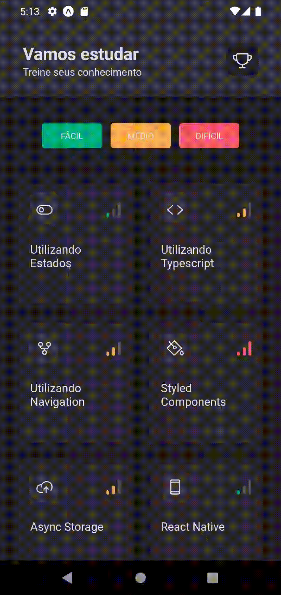
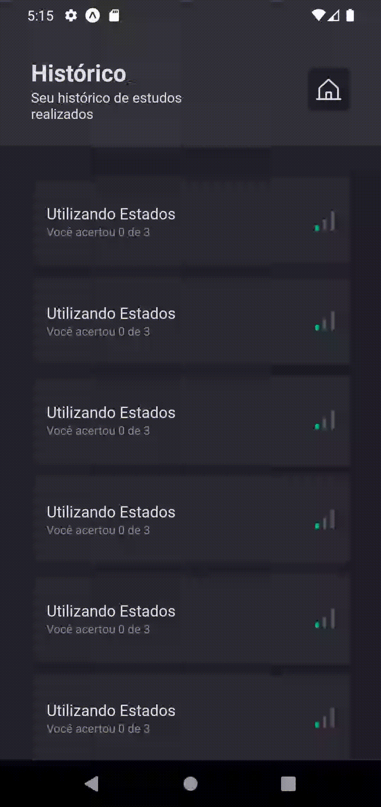
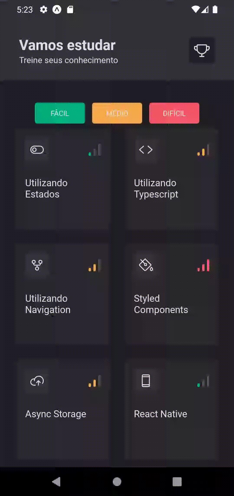

  

  
  

<h1 align="center">🔥 Ignite Quiz</h1>

## 💻 Projeto

Aplicativo desenvolvido durante a trilha de React Native da Rocketseat, com o objetivo de criar uma experiência interativa de quiz, utilizando recursos avançados de animação, gestos e feedback visual. O projeto explora integração com SVGs, animações em thread nativa, manipulação de áudio e respostas táteis.

## 📸 **Pré-visualização do App**

Animações sutis em componentes importantes de listagem:
- Na primeira imagem os filtros possuem feedback visual aprimorada com o toque, e a listagem das opções é remontada de forma visualmente sequencial
- Na segunda imagem as microinterações aprimoram a experiencia do usuário (UX) permitindo que ejam removidos da lista ao arrastar para o lado, e o reposicionamento dos elementos também é aprimorado visualmente com animação com efeito de "mola"

  
  

Animações em ações que tornam a experiencia mais interessante
- Na primeira imagem, ao acessar a pergunta ela tem efeito de carta rotacionando para a tela
- Na segunda imagem a seleção das alternativas possui feedback visual totalmente personalizado e a barra de progresso acompanha o scroll 

  
  

Animações de contexto que aprimoram a usabilidade principal
- Na primeira imagem mostra o feedback ao acertar: todo o fundo com efeito verde, e som de estrela (visual e sonoro)
- Na segunda imagem mostra o feedback ao errar: todo o fundo com efeito vermelho, som de trombeta e dispositivo vibra (visual, sonoro e tátil)
- Na terceira imagem mostra o feedback ao pular: microinteração ao arrastar para a esquerda, pula para a proxima questão
- Na quarta imagem mostra o feedback ao finalizar o quiz troféu com efeito de mola e estrelas piscando em ritmo diferente

  
  

  
  

## 🚀 Tecnologias e Bibliotecas Utilizadas

### ✨ Animações e Interações

* [**react-native-reanimated**](https://docs.swmansion.com/react-native-reanimated/docs/fundamentals/getting-started/)

  * Animações com melhor performance na thread nativa.
  * Comando: `npx expo install react-native-reanimated`
  * Configurado em [`babel.config.js`](./babel.config.js)
  * 📅 Instalado em: 18/06/2025

* [**react-native-gesture-handler**](https://docs.swmansion.com/react-native-gesture-handler/docs/fundamentals/installation)

  * Suporte a gestos e interações do usuário.
  * Comando: `npx expo install react-native-gesture-handler`
  * 📅 Instalado em: 23/06/2025

* [**expo-haptics**](https://www.npmjs.com/package/expo-haptics)

  * Feedback tátil (vibração) para interações mais imersivas.
  * Comando: `npx expo install expo-haptics`
  * 📅 Instalado em: 26/06/2025

### 🎨 Gráficos e Visuais

* [**expo-skia**](https://docs.expo.dev/versions/latest/sdk/skia/)

  * Renderização de gráficos e visuais dinâmicos.
  * Comando: `npx expo install @shopify/react-native-skia`
  * 📅 Instalado em: 24/06/2025

* [**react-native-svg**](https://docs.expo.dev/versions/latest/sdk/svg/)

  * Manipulação e exibição de imagens SVG como componentes.
  * Comando: `npx expo install react-native-svg`
  * 📅 Instalado em: 25/06/2025

* [**react-native-svg-transformer**](https://github.com/kristerkari/react-native-svg-transformer)

  * Permite importar SVGs diretamente como componentes React.
  * Comando: `npm install --save-dev react-native-svg-transformer`
  * Configurado em [`metro.config.js`](./metro.config.js)
  * 📅 Instalado em: 25/06/2025

### 🔊 Mídia

* [**expo-av**](https://docs.expo.dev/versions/latest/sdk/av/)

  * Suporte a reprodução de áudio.
  * Comando: `npx expo install expo-av`
  * 📅 Instalado em: 26/06/2025

## 📝 Licença

Esse projeto está sob a licença MIT. Veja o arquivo [LICENSE](LICENSE) para mais detalhes.

---

  Feito com 💜 por Cesar + Rocketseat

